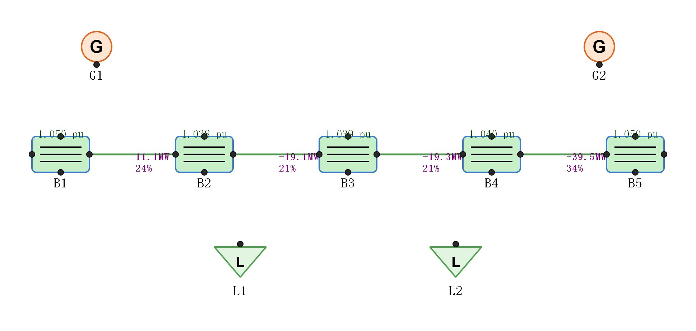

# 潮流计算 GUI · Power Flow Studio

[](https://github.com/704315792-crypto/PowerFlowStudio/actions/workflows/tests.yml)

一个基于 PyQt5 的电力系统潮流计算可视化工具。左侧元件库, 中间画布自由拖拽搭建电网, 右侧编辑参数和查看结果, 内核使用成熟的 pandapower(牛顿-拉夫逊法)。



*5 母线两端供电示例: 母线按电压着色, 连线按负载率着色并标注 P/负载率*

📖 **新手请看 [docs/tutorial.md](docs/tutorial.md) 图文教程** (10 分钟上手全功能)。

## 功能

- **元件**: 母线 / 电源(发电机) / 负荷 / 变压器 / 串联阻抗
- **自由拖拽**: 元件放到画布任意位置; 端口之间拖拽连线建立连接; 滚轮缩放, Ctrl+0 适配视图
- **拖线换母线**: 把 Gen/Load 拖线连到另一条母线, 挂接关系自动转正
- **属性编辑**: 选中元件(或连线), 右侧面板改参数(实时生效)
- **潮流计算**: ▶ 运行牛顿-拉夫逊; 勾选 "DC 直流模式" 切换直流潮流
- **平衡节点可选**: 勾选任一发电机为平衡节点(Slack), 默认仍取第一台
- **N-1 校核**: 一键逐条开断线路/变压器, 报告越限与孤立母线
- **OPF 最优潮流**: 发电成本最小化调度 (发电机可设成本与出力上下限)
- **三相短路计算**: 最大/最小运行方式, 母线 Ikss (kA)
- **并联电容/电抗器**: 新元件类型, 电压调节
- **变压器分接头**: tap_pos 档位调节
- **小地图 / 搜索定位(Ctrl+F) / 多选对齐分布 / 网损统计**
- **发电机 PV/PQ 模式** 与 **分布式松弛** (按权重分摊网损功率)
- **画布导出 SVG** (矢量图, 与 PNG 并列)
- **结果可视化**: 母线按电压标幺着色(绿/黄/红/灰=孤立), 结果总览表 + 电压柱状图 (dock)
- **结果导出**: 一键导出母线/支路两个 CSV (utf-8-sig, Excel 直接打开)
- **撤销/重做**: Ctrl+Z / Ctrl+Shift+Z, 增删元件与连线均可撤销
- **右键菜单**: 重命名 / 删除 / 运行潮流 / 适配视图
- **标准算例**: 菜单一键加载 IEEE 14 / 30 / 39 / 57 / 118 母线测试系统
- **拓扑保存/加载**: 整张电网保存为 JSON(原子写), 载入带完整校验
- **示例一键加载**: 3 母线测试网 / 5 母线两端供电

## 安装

```bash
# 推荐: 使用 uv (依赖版本见 requirements.txt, 已在 Python 3.13 验证)
uv venv .venv
source .venv/bin/activate      # Linux/WSL/macOS
# .venv\Scripts\activate       # Windows
uv pip install -r requirements.txt

# 或者直接用 pip
pip install -r requirements.txt
```

## 运行

```bash
source .venv/bin/activate
python app.py
```

启动后:
1. 工具栏点 "★ 加载示例", 看到 3 母线示例自动跑一次潮流
2. 或从左侧元件库点击元件, 然后在画布上点击放置
3. 把鼠标放到元件边缘的黑色小圆点(端口)上, 拖到另一个元件的端口建立连接
4. 选中元件, 在右侧面板修改参数
5. 工具栏点 "▶ 运行潮流"; 滚轮缩放画布, Ctrl+0 适配视图

## 运行测试

```bash
pip install -r requirements-dev.txt
python -m pytest tests -q
```

`solver` 层 17 个单元用例 + GUI offscreen 冒烟测试, 不需要显示器。

## 打包成 exe

### 直接下载

最新编译好的 Windows exe 在 [Releases 页面](https://github.com/704315792-crypto/PowerFlowStudio/releases/latest) 下载:
[PowerFlowStudio.exe](https://github.com/704315792-crypto/PowerFlowStudio/releases/latest/download/PowerFlowStudio.exe)

下载后双击即可运行, 无需安装 Python.

### 从源码打包 (Windows)

直接双击项目根目录的 `build_windows.bat`, 脚本会自动:
1. 创建虚拟环境 `.venv`
2. 装 PyQt5 / pandapower / pyinstaller
3. 跑 pyinstaller 产出 `dist\PowerFlowStudio.exe`

第一次打包 1-3 分钟, 之后增量打包 30 秒左右. 产物单文件 80-150MB.

如果想自己手动跑:

```cmd
cd PowerFlowStudio
py -m venv .venv
.venv\Scripts\activate
pip install -r requirements-dev.txt
pyinstaller --onefile --windowed --name PowerFlowStudio app.py
:: 产物: dist\PowerFlowStudio.exe
```

注意:
- 第一次打包比较慢(数十秒到几分钟)
- 单文件 exe 体积 80-150MB(包含 pandapower + numpy + PyQt5)
- Windows: 直接双击 `dist\PowerFlowStudio.exe` 运行
- Linux: `pyinstaller --onefile --windowed app.py`, 产物 `dist/PowerFlowStudio`(ELF); 运行需 `sudo apt install libxcb-xinerama0 libxkbcommon-x11-0`

## 文件结构

```
PowerFlowStudio/
├── app.py          # 主入口, 工具栏/菜单/快捷键
├── canvas.py       # QGraphicsView 画布, 元件与连线
├── palette.py      # 左侧元件库面板
├── properties.py   # 右侧属性编辑面板
├── solver.py       # 拓扑 ↔ pandapower 转换 + 潮流计算
├── tests/          # pytest 单元 + GUI offscreen 冒烟测试
└── README.md
```

## 键盘快捷键

- `Ctrl+R`: 运行潮流
- `Ctrl+L`: 加载示例
- `Ctrl+Z` / `Ctrl+Shift+Z`: 撤销 / 重做 (含元件移动)
- `Ctrl+C` / `Ctrl+V`: 复制 / 粘贴选中元件
- `Ctrl+N`: 新建 (带未保存确认)
- `Ctrl+S`: 保存
- `Ctrl+0`: 适配视图
- `Delete` / `Backspace`: 删除选中元件或连线
- `ESC`: 取消正在拖的连线 / 取消选中

## 当前限制

- 不支持 OPF / 短路 / 时域仿真(只做稳态潮流, DC 模式仅算有功/相角)
- 多台发电机勾选平衡节点时只有第一台生效, 其余按 PV 节点处理
- 变压器两端必须接到两个不同母线(创建时会自动避让)
- 撤销不覆盖"拖动位置"(变压器/阻抗位置本就不存档)
- 保存 JSON 时不含计算结果(只存拓扑)

## 扩展方向

- 发电机 PV/PQ 节点类型自由切换
- 内嵌时域仿真接口
- OPF 最优潮流 (pandapower 自带 runopp)
- 复制粘贴 / 多选批量编辑
- DC 潮流模式下发电机 P 分配策略(当前 slack 吸收全部网损)
